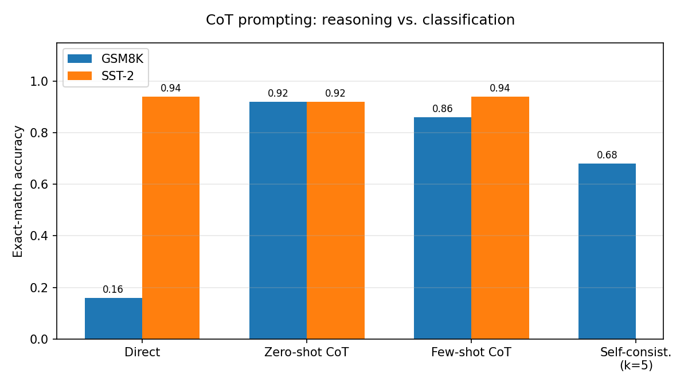

# When Does Chain-of-Thought Help?
**A controlled study of prompting strategies on reasoning vs. classification tasks**

MSc Computer Science, Sapienza University of Rome, NLP course project · Amirhossein Khishvand · 2026

📄 [Full report](report.pdf) · 📓 [Notebook](CoT_Experiment.ipynb)

## Overview
Chain-of-Thought (CoT) prompting often improves LLM reasoning, but it multiplies the number of generated tokens, and with them latency and cost. This project asks **when CoT is actually worth it**. It keeps the model and data fixed and changes only the prompting strategy, on two contrasting tasks:

- **GSM8K**: multi-step arithmetic word problems (needs reasoning)
- **SST-2**: binary sentiment classification (a shallow, one-step task)

**Hypothesis:** CoT gives a large gain on GSM8K and almost none on SST-2.

## Setup
| | |
|---|---|
| Model | `Qwen/Qwen2.5-7B-Instruct` (4-bit, bitsandbytes) |
| Conditions | Direct (baseline), zero-shot CoT, few-shot CoT, self-consistency (k = 5, GSM8K only) |
| Data | 50 examples per task and condition, fixed seed (0) |
| Metric | Exact-match accuracy (regex answer extraction, robust to `\boxed{}` / LaTeX) |
| Decoding | Greedy for Experiment 1; T = 0.7, top-p = 0.95 sampling + majority vote for Experiment 2 |
| Hardware | 1× NVIDIA T4 (16 GB), Lightning AI |

## Results
| Condition | GSM8K | SST-2 |
|---|---:|---:|
| Direct | 0.16 | 0.94 |
| Zero-shot CoT | **0.92** | 0.92 |
| Few-shot CoT | 0.86 | 0.94 |
| Self-consistency (k=5) | 0.68 | — |



**Key findings**
- CoT raises GSM8K accuracy from **0.16 to 0.92** (+76 points). On SST-2 it changes almost nothing, which supports the hypothesis.
- The zero-shot trigger ("Let's think step by step") was enough. Few-shot examples added no benefit.
- Self-consistency *underperformed* single-chain CoT. The main cause is a generation-budget mismatch: sampled chains were capped at 256 new tokens vs. 512 for greedy CoT, so longer chains were cut off before stating an answer. Small-sample variance (N = 50) also contributes. See the report for the full discussion.

## Reproduce
```bash
pip install -r requirements.txt
jupyter notebook CoT_Experiment.ipynb
```
Set `DEBUG = True` for a quick CPU smoke test with `Qwen2.5-0.5B-Instruct` on 5 examples, or `DEBUG = False` for the full GPU run. Per-example outputs are saved to `results.csv`.

## Limitations and future work
One model, one run per condition, 50-example subsets. Next steps: a matched generation budget for self-consistency, a sweep over k, full test sets with multiple seeds, and a second model size.

## References
- Wei et al., *Chain-of-Thought Prompting Elicits Reasoning in Large Language Models*, NeurIPS 2022, [arXiv:2201.11903](https://arxiv.org/abs/2201.11903)
- Kojima et al., *Large Language Models are Zero-Shot Reasoners*, NeurIPS 2022, [arXiv:2205.11916](https://arxiv.org/abs/2205.11916)
- Wang et al., *Self-Consistency Improves Chain of Thought Reasoning in Language Models*, ICLR 2023, [arXiv:2203.11171](https://arxiv.org/abs/2203.11171)
- Cobbe et al., *Training Verifiers to Solve Math Word Problems* (GSM8K), [arXiv:2110.14168](https://arxiv.org/abs/2110.14168)
- Socher et al., SST, EMNLP 2013; Wang et al., GLUE, ICLR 2018; Qwen Team, Qwen2.5 Technical Report, 2024
